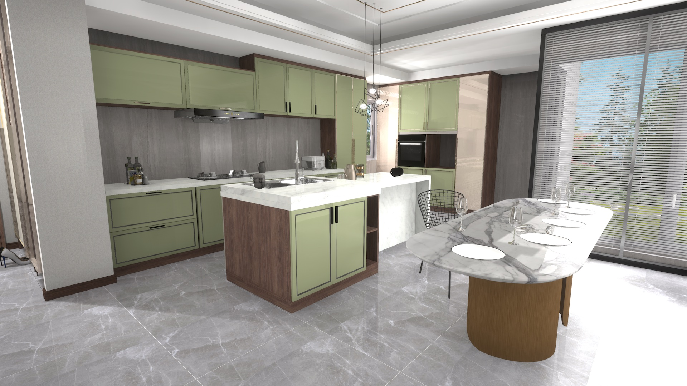

# SPEAR

Interactive simulators are becoming powerful tools for training embodied agents, but existing simulators suffer from limited content diversity, physical interactivity, and visual fidelity. We address these limitations by introducing SPEAR, a Simulator for Photorealistic Embodied AI Research. To create our simulator, we worked closely with a team of professional artists for over a year to construct 300 unique virtual indoor environments with 2,566 unique rooms and 17,234 unique objects that can be manipulated individually. Each of our environments features detailed geometry, photorealistic materials, and a unique floor plan and object layout designed by a professional artist, i.e., we do not rely on remixing existing layouts to create additional content. Our environments are implemented as Unreal Engine assets, and we provide an OpenAI Gym interface for interacting with the environments via Python.

The SPEAR code is released under an [MIT license](LICENSE.txt), and the SPEAR assets are released under a [license](LICENSE_ASSETS.txt) that permits academic use.

## Citation

If you find SPEAR useful in your research, please cite this repository as follows:

```
@misc{roberts:2022,
    author       = {Mike Roberts AND Quentin Leboutet AND Rachith Prakash AND Renhan Wang AND
                    Marti Ferragut AND Hailin Zhang Rui Tang AND Stefan Leutenegger AND
                    Stephan R. Richter AND Vladlen Koltun AND Matthias M{\"u}ller AND German Ros},
    title        = {{SPEAR}: {A} Simulator for Photorealistic Embodied AI Research},
    howpublished = {\url{http://github.com/isl-org/spear}},
    year         = {2022},
}
```

## Getting Started

### Download precompiled binaries and scene data

The easiest way to start working with SPEAR is to download a precompiled binary for your platform. You will also need to download our test scene. See our latest release notes for download links.

### Install the `spear` Python package

Our next step is to install the `spear` Python package as follows.

```console
# create environment
conda create --name spear-env python=3.8
conda activate spear-env

# install pip
conda install -c anaconda pip

# install msgpack-rpc-python separately from other Python dependencies so
# we can use a specific commit from the msgpack-rpc-python GitHub repository
pip install -e third_party/msgpack-rpc-python

# install the spear Python package
pip install -e python
```

### Configure the behavior of SPEAR

Our final step is to configure the behavior of SPEAR using a configuration file. We include a configuration file named `user_config.yaml.example` with each of our example applications to use as a starting point. To run each example application, you must rename this file to `user_config.yaml` and modify the contents appropriately for your system. In particular, you must set the following parameters.
  - `SPEAR.STANDALONE_EXECUTABLE` is the location of your precompiled `SpearSim` binary.
  - `SPEAR.DATA_DIR` is the directory containing the test scene.
  - `SPEAR.CONTENT_DIR` is the `Content` directory corresponding to your precompiled `SpearSim` binary.

Your `user_config.yaml` file only needs to specify the value of a parameter if it differs from the defaults defined in the `python/config` directory.

### Run an example application

We are now ready to run an example application.

```console
python examples/getting_started/run.py
```

We recommend browsing through our example applications to get a sense of what is currently possible with SPEAR.
  - [`examples/getting_started`](examples/getting_started) demonstrates how to control a sphere agent or an OpenBot agent and obtain egocentric observations.
  - [`examples/generate_image_dataset`](examples/generate_image_dataset) demonstrates how to generate a static image dataset using our camera agent.
  - [`examples/imitation_learning_openbot`](examples/imitation_learning_openbot) demonstrates how to collect training data that can be plugged into the OpenBot framework.
