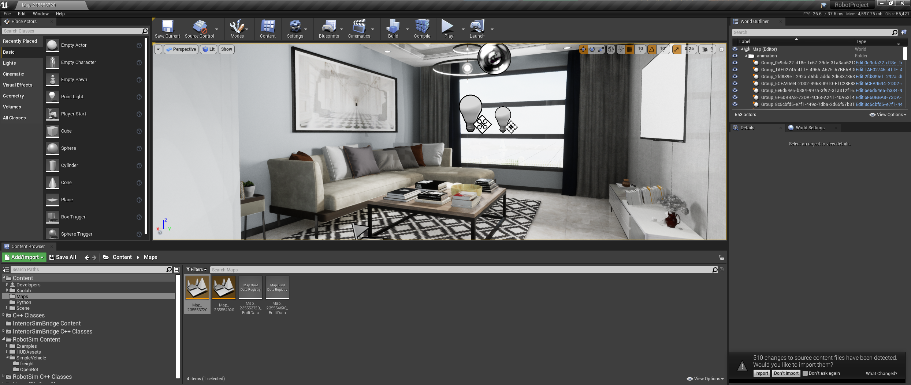

# Running OpenBot within InteriorSim as a Standalone Executable for Machine Learning Purposes: 

The following README file will guide you through the different steps required to compile and run the OpenBot simulation in a photorealistic environment and then interact with this simulation via a dedicated python client. It is here assumed that you are using [**Ubuntu 20.04**](https://releases.ubuntu.com/20.04/).

## I: Getting started with InteriorSim 

### I.1: Overview

In its current version, **InteriorSim** is the result of a synergy between **three different plugins**, bundled into a single Unreal-Engine [project](https://github.com/isl-org/interiorsim/tree/main/code/unreal_projects/RobotProject):
- [**RobotSim**](https://github.com/isl-org/interiorsim/tree/main/code/unreal_plugins/RobotSim): implements the a set of useful control routines needed to describe the agents involved in the simulation and their behaviror. 
- [**UnrealRL**](https://github.com/isl-org/unreal-ai/tree/main/unreal/Plugins/UnrealRL): provides the required tools for researchers to perform Reinforcement Learning experiments with Unreal Engine environments. It provides in particular a server interface allowing external clients to interact with the simulation. It is currently part of the [Unreal-AI](https://github.com/isl-org/unreal-ai) repository (*but will eventually be merged into InteriorSim*). 
- [**InteriorSimBridge**](https://github.com/isl-org/interiorsim/tree/main/code/unreal_plugins/InteriorSimBridge): specializes the behavior of UnrealRL to match InteriorSim requirements and acts as a high-level interface between the simulation actors and an external client. 

The following sections provide step-by-step information on how to setup an InteriorSim environment from ground up. 
### I.2: Geting a working Unreal-AI setup

At the time this README file is written (march 2022), [InteriorSim](https://github.com/isl-org/interiorsim) still depends on the [UnrealRL](https://github.com/isl-org/unreal-ai/tree/main/unreal/Plugins/UnrealRL) plugin containted in the [Unreal-AI](https://github.com/isl-org/unreal-ai) repository. Therefore, unless you already have a working Unreal-AI setup, you should first go through the following steps ot initialize it: 

- Start by cloning the [Unreal-AI](https://github.com/isl-org/unreal-ai) repository and its submodules:

  ```bash
  git clone --recurse-submodules git@github.com:isl-org/unreal-ai.git
  ```

- Build the different third-party C++ libraries required by [UnrealRL](https://github.com/isl-org/unreal-ai/tree/main/unreal/Plugins/UnrealRL) using the following commands:

  ```bash
  cd <path/to/unreal-ai>/utils
  ./build_external_libs.sh
  ``` 

  To successfully execute this script, you should have `clang` (Version 10) installed on your machine; see e.g. https://releases.llvm.org/download.html

- We recommend creating a dedicated conda environment for Unreal-AI (if not already done). Instructions on installing conda can be found [here](https://docs.conda.io/projects/conda/en/latest/user-guide/install/). You can create a new environment with the following command:

  ```bash
  conda create --name unreal-ai-env pip # Create a new Conda environment and install pip in it
  ```
  If you do not want install the dependencies globally, activate your conda environment first:

  ```bash
  conda activate unreal-ai-env
  ```

- You can then start installing the required unreal-ai third-party python packages:
  
  ```bash
  cd <path/to/unreal-ai>/thirdparty
  pip install -e msgpack-rpc-python
  ```

- Install the python client:

  ```bash
  cd <path/to/unreal-ai>
  pip install -e client/python
  ```
  This client will allow you to interact with the simulation. It is therefore **critically important** to set it correctly. Client settings are specified within a dedicated `.yaml` parameter file located in `<path/to/unreal-ai>/client/python/unrealai`. 
  Assuming you have just cloned [Unreal-AI](https://github.com/isl-org/unreal-ai), a `default_config.yaml` file containing a set of default parameters should already be available in `<path/to/unreal-ai>/client/python/unrealai`. Your next task should therefore be genrate a new `.yaml` file named `config.yaml` and to document it with your own settings: 
  ```bash
  cd <path/to/unreal-ai>/client/python/unrealai
  cp default_config.yaml user_config.yaml
  gedit user_config.yaml
  ```

  Your `config.yaml` setting file should at least contain the following fields: 

  ```yaml
  # launch unreal engine instance via different modes
  # "standalone_executable", or "uproject", or "running_instance"
  # "standalone_executable" - launches a packaged executable of an Unreal Engine project
  # "uproject" - launches an uproject with Unreal Engine editor executable
  # "running_instance" - connects to an already running instance of Unreal Engine
  LAUNCH_MODE: "standalone_executable"

  # if launch_mode is "standalone_exectuable", specify this path to an unreal engine executable
  STANDALONE_EXECUTABLE: "<path/to/interiorsim>/code/unreal_project/RobotSim/dist>"

  # True if unreal engine instance should be launched in headless mode
  # Note: This flag is unused if your launch_mode is "running_instance"
  RENDER_OFFSCREEN: False

  # Allows to avoid "settings.json not found" error at simulation start
  ROBOTSIM_SETTINGS_PATH: "<path/to/interiorsim>/code/unreal_projects/RobotProject/dist/LinuxNoEditor/setting/settings.json"

  # Path to the map you want to load, based on the map codes provided in virtualworld-ids.json.
  # Allows to start the packaged environment while automatically loading the desired map.
  MAP_ID: "" 
  ```

- Once `config.yaml` is properly set, you should generate a project-specific `.yaml` config file for InteriorSim. This can be done programatically using the [generate_config.py](https://github.com/isl-org/unreal-ai/blob/main/utils/generate_config.py) python script:
  ```bash
  cd <path/to/unreal-ai>/utils
  python generate_config.py --config_files <path/to/file> --output_unreal_project_dir <path/to/output/unreal/project/dir>
  ```
  - The `--config_files` argument should contain a list of config file locations. If this argument is skipped, only `<path/to/unreal-ai>/client/python/default_config.yaml` from unrealai package will be used to generate an output config file. 
  - The `--output_unreal_project_dir` argument should contain the location of the Unreal project directory where you want the generated config file written to.
  - For help with parameters, you can run `python utils/generate_config.py --help`.

  Typically: 
  ```bash
  python generate_config.py --config_files <path/to/unreal-ai>/client/python/unrealai/user_config.yaml  --output_unreal_project_dir <path/to/interiorsim>/code/unreal_projects/RobotProject
  ```
- UE4 is split into modules. Each module has a ´.build.cs´ file that controls how it is built, including options for defining module dependencies, additional libraries, include paths, etc. A default build configuration for UnrealRL is provided in the file `<path/to/unreal-ai>/unreal/Plugins/UnrealRL/Source/UnrealRL/UnrealRL.Build.cs.example`. You should rename this file as `UnrealRL.Build.cs` and modify it to match your system configuration:
  ```bash
  cd <path/to/unreal-ai>/unreal/Plugins/UnrealRL/Source/UnrealRL/
  cp UnrealRL.Build.cs.example UnrealRL.Build.cs
  gedit UnrealRL.Build.cs
  ```

You should by now have fully fledge Unreal-AI setup and should therefore proceed with InteriorSim.

### I.3: Install and build InteriorSim dependencies

- Start by installing the following libraries in order to compile InteriorSim: 

  ```bash
  sudo apt install clang
  sudo apt install libc++-dev libc++abi-dev
  sudo apt install libeigen3-dev
  ```
- Download and build the Rigid Body Dynamics Library (RBDL). RBDL is here only needed for URDF file parsing purposes and inverse kinematics computation on the URDF-bot. Nevertheless, being listed as a dependency for the whole RobotSim plugin, it must be included into the project:

  ```bash
  cd interiorsim/code
  mkdir thirdparty
  cd thirdparty
  git clone https://github.com/rbdl/rbdl
  cd rbdl
  mkdir BUILD
  cd BUILD
  cmake -D CMAKE_BUILD_TYPE=Release -D RBDL_BUILD_STATIC=ON -D RBDL_BUILD_ADDON_URDFREADER=ON -D CMAKE_CXX_COMPILER="clang++" -D CMAKE_CXX_FLAGS="-fPIC -stdlib=libc++" ../
  make
  ```

### I.4: Configure the InteriorSim repository
- The next step is to let the compiler know that you want to link the [RobotSim](https://github.com/isl-org/interiorsim/tree/main/code/unreal_plugins/RobotSim), [UnrealRL](https://github.com/isl-org/unreal-ai/tree/main/unreal/Plugins/UnrealRL) and [InteriorSimBridge](https://github.com/isl-org/interiorsim/tree/main/code/unreal_plugins/InteriorSimBridge) plugins to an Unreal project named *RobotProject*. It is within this environment that the simulation will be executed. Assuming you are in the *interiorsim* root, you should therefore execute:

  ```bash
  cd interiorsim/code/unreal_projects/RobotProject
  mkdir Plugins
  cd Plugins
  ln -s ../../../unreal_plugins/InteriorSimBridge .
  ln -s ../../../unreal_plugins/RobotSim .
  ln -s <path/to/unreal-ai>/unreal/Plugins/UnrealRL .
  ```

- A default build configuration for RobotSim is provided in the file `<path/to/interiorsim>/code/unreal_plugins/RobotSim/Source/RobotSim.Build.cs.example`. You should rename this file as `UnrealRL.Build.cs` and modify it to match your system configuration:
  ```bash
  cd <path/to/interiorsim>/code/unreal_plugins/RobotSim/Source/
  cp RobotSim.Build.cs.example RobotSim.Build.cs
  gedit RobotSim.Build.cs
  ```

### I.5: Build, Cook, Package and Run RobotProject as a Standalone Unreal Executable

#### I.5.1: Clarification about the Build Pipeline within UE4

The main software component used to build and package an Unreal project is the [Unreal Automation Tool (UAT)](https://docs.unrealengine.com/4.26/en-US/ProductionPipelines/BuildTools/AutomationTool/). The UAT provides a set of *commandlets*, namely relevant macros providing access to various functionalities of the engine's ecosystem, and used to automate the build process. The UAT tool is started using the `RunUAT.sh` script, located in the `Engine/Build/BatchFiles/Linux` folder of the main `UE_4.26` repository. It should be mentioned that calling the UAT with the `-list` flag will return a list of every available *commandlets*:
```
path/to/UE_4.26/Engine/Build/BatchFiles/Linux/Build.sh -list
```
Additional information can also be retrieved using the `-help` flag: 
```
path/to/UE_4.26/Engine/Build/BatchFiles/Linux/Build.sh -help
```
Note that the `-help` flag is also available for each commandlet:
```
path/to/UE_4.26/Engine/Build/BatchFiles/Linux/Build.sh <Commandlet> -help
```

**Important note**: 
    
  No *complex* map is included in the InteriorSim project by default. By building and cooking the project "as is", you will only be able to spawn the robot in a simplistic environment. Downloading a new map will then require you to recook the project, which can be time consumming.
  Before executing the "build + cook" step, you may thus want to check the map download procedure in chapter [II.2](#II.2:-Edit-a-Photorealistic-Environment-using-the-Unreal-Editor) of this document. 
#### I.5.2: Step-by-step Process to Build, Cook, Package and Run your Project

- **BuildCookRun Commandlet**
  
  Execute the [Unreal Automation Tool (UAT)](https://docs.unrealengine.com/4.26/en-US/ProductionPipelines/BuildTools/AutomationTool/):

  ```bash
  # Needs to be call the first time you build the project (or when you modify an asset):
  <path/to/UE_4.26>/Engine/Build/BatchFiles/RunUAT.sh BuildCookRun -project=<path/to/interiorsim>/code/unreal_projects/RobotProject/RobotProject.uproject -build -cook -stage -package -archive -archivedirectory=<path/to/interiorsim>/code/unreal_projects/RobotProject/dist -targetplatform=Linux -target=RobotProject -nodebuginfo -clientconfig=Development
  ```
  The [cooking](https://docs.unrealengine.com/4.26/en-US/SharingAndReleasing/Deployment/Cooking/) process is time consumming. Its overall duration is strongly correlated to the number of assets you link to your project (i.e. the number and complexity of maps and agents your project contains). It is worth emphasizing that the cooking process will have to be repeated **every time you make a modification to your environment or to one of its assets**. 

- **Alternative version of the BuildCookRun Commandlet**
  
  In case the UBT and cooking process were already executed and **no asset was edited**, the cooking process can be skipped for the next build iterations using the `-skipcook` flag:

  ```bash
  # Build, skip cook (allows saving cooking time when no asset was modified)
  <path/to/UE_4.26>/Engine/Build/BatchFiles/RunUAT.sh BuildCookRun -project=<path/to/interiorsim>/code/unreal_projects/RobotProject/RobotProject.uproject -build -skipcook -skipstage -skiparchive -package -targetplatform=Linux   -target=RobotProject -nodebuginfo -clientconfig=Development
  ```
  This usually makes the whole build process **way** faster.

  Here is the detail of some relevant UAT flags: 
  - `BuildCookRun`: use the BuildCookRun commandlet
  - `-project=”<ProjectPath>/<ProjectName>.uproject”`: -- **required** -- absolute path to your `.uproject` file
  - `-build`: build the project
  - `-clean`: wipe intermediate folders before building
  - `-run`: run the game after it is built
  - `-cook`: [cooks](https://docs.unrealengine.com/4.26/en-US/SharingAndReleasing/Deployment/Cooking/) the project's assets
  - `-skipcook`: use a cooked build, assuming the cooked data is up to date and where it belongs (i.e. UAT was previously executed with the `-cook` flag)
  - `-IgnoreCookErrors`: Ignores cook errors and continues with packaging etc...
  - `-stage`: save the cook result in a stage directory
  - `-skipstage`: uses a stage directory, but assumes everything is already there (i.e. UAT was previously executed with `-stage`)
  - `-package`: create a package for the target platform (e.g. a `.app` file on Mac, `.sh` on Linux)
  - `-skippackage`: skips packaging the project for the target platform
  - `-archive`: archive the complete output in a directory
  - `-archivedirectory=<ArchivePath>`: The path to archive the project builds
  - `-targetplatform=<Platform>`: target platform for building, cooking and deployment
  - `-map`: map to run the game with. If not specified, the command looks for `DefaultMap` entry in the project's `DefaultEngine.ini` and if not found, in `BaseEngine.ini`. If no DefaultMap can be found, the command falls back to `/Engine/Maps/Entry`.
  - `-nocompileeditor`: omitting this flag should build the editor parts we previously built using the UBT, however this does not seems to work...
  - `-nodebuginfo`: do not copy debug files to the stage
  - `-separatedebuginfo`: output debug info to a separate directory
  

#### I.5.3: Troubleshooting 
Executing the [Unreal Automation Tool (UAT)](https://docs.unrealengine.com/4.26/en-US/ProductionPipelines/BuildTools/AutomationTool/) should normally also builds the Editor targets. However, this process appears to be broken on some platforms. As a workaround, the build process therefore has to be divided in two distinct steps:

- In the first step, one should call the [Unreal Build Tool (UBT)](https://docs.unrealengine.com/4.26/en-US/ProductionPipelines/BuildTools/UnrealBuildTool/) in order to get up-to date versions of our editor binaries.
- The [Unreal Automation Tool (UAT)](https://docs.unrealengine.com/4.26/en-US/ProductionPipelines/BuildTools/AutomationTool/) can then be executed with the `-nocompileeditor` flag, in order to skip the editor build step (and the associated error).

- **Step 1: Building the Editor Target**

  Run the [Unreal Build Tool (UBT)](https://docs.unrealengine.com/4.26/en-US/ProductionPipelines/BuildTools/UnrealBuildTool/) in the **Development** configuration:

  ```bash
  path/to/UE_4.26/Engine/Build/BatchFiles/Linux/Build.sh <ProjectName>Editor Linux Development <path/to/interiorsim>/code/unreal_projects/RobotProject/RobotProject.uproject
  ```
  For a clean build either the `Clean.sh` script can be run before or instead of the `Build.sh` script the `Rebuild.sh` script can be used. Check the Unreal Engine compile pipeline [documentation](https://docs.unrealengine.com/4.26/en-US/SharingAndReleasing/Deployment/BuildOperations/). 
  
- **Step 2: BuildCookRun Commandlet**
  
  Execute the [Unreal Automation Tool (UAT)](https://docs.unrealengine.com/4.26/en-US/ProductionPipelines/BuildTools/AutomationTool/) with the `-nocompileeditor` flag:

  ```bash
  # Needs to be call the first time you build the project (or when you modify an asset):
  <path/to/UE_4.26>/Engine/Build/BatchFiles/RunUAT.sh BuildCookRun -project=<path/to/interiorsim>/code/unreal_projects/RobotProject/RobotProject.uproject -build -cook -stage -package -archive -archivedirectory=<path/to/interiorsim>/code/unreal_projects/RobotProject/dist -targetplatform=Linux -target=RobotProject -nocompileeditor -nodebuginfo -clientconfig=Development
  ```

## II: Loading a new scene into Unreal Engine 4

### II.1: Download a Photorealistic Interior Environment 

Download one of the available photorealistic interior environments (for instance 235553720):

```bash
cd code/unreal_projects/RobotProject/SceneManager
python scene_manager.py -i 235553720 -v v2 -d true
```

A complete list of the available environments can be found in the [virtualworld-ids.json](../../unreal_projects/RobotProject/SceneManager/Data/virtualworld-ids.json) parameter file. 
Remember that the more environments you download, the greater the cooking time... 

Adjust the `MAP_ID` field within the `<path/to/unreal-ai>/client/python/unrealai/config.yaml` setting file: 

  ```yaml
  # Path to the map you want to load, based on the map codes provided in virtualworld-ids.json.
  # Allows to start the packaged environment while automatically loading the desired map.
  MAP_ID: "/Game/Maps/Map_235553720" 
  ```

Finally regenerate config: 
  ```bash
  python generate_config.py --config_files <path/to/unreal-ai>/client/python/unrealai/config.yaml  --output_unreal_project_dir <path/to/interiorsim>/code/unreal_projects/RobotProject
  ```
### II.2: Edit a Photorealistic Environment using the Unreal Editor 

It is here assumed you successfully downloaded one of the photorealistic environments. In its current version, the InteriorSim code requires a `goal` actor to be placed in the environment, for reinforcement learning purposes. Since this actor is not included by default within the downloaded environment, it is -- for now -- your task to place it. To do so, doubleclick on the `RobotProject.uproj` project file in `<path/to/interiorsim>/code/unreal_projects/RobotProject`. The Unreal Editor should start and load a simple project with an empty environment. You should then load the downloaded map using the content browser in the lower left corner of your screen:


The map should take around 30-50 seconds to load the first time you open it: 


Once done, you should then be able to move and explore the new environment: 



Adding a goal actor can be achieved by adding an empty pawn to the map using the **PlaceActor** menu on the left side of your screen. The new pawn should be in a reachable location and -- more importantly -- should be labelled as a "**goal**". You can label your pawn using the "Actor" properties menu on the right of your screen: 


Once this is done, save your changes to the environment. Then **rebuild + cook** your project:

```bash
# Build cook and package (needs to be done the first time you build or when you modify an asset)
path/to/UE_4.26/Engine/Build/BatchFiles/RunUAT.sh BuildCookRun -project=path/to/interiorsim/code/unreal_projects/RobotProject/RobotProject.uproject -build -cook -stage -package -archive -archivedirectory=path/to/interiorsim/code/unreal_projects/RobotProject/dist -targetplatform=Linux -target=RobotProject -nocompileeditor -nodebuginfo -nop4
```

You should now be ready to test the executable using the python client...

## III: Running the simulation using the python interface
### III.1: Imitation Learning Scenario

#### III.1.1: Data Collection

Running the imitation_learning_test.py script to launch the OpenBot simulation
Assuming that you have a virtual env named *interiorsim-env*, run the RL script providing the path to your **config.yaml** parameter file:

```bash
cd interiorsim/code/experiments/RL_script
conda activate interiorsim-env
python run.py --iterations=1000 --session=1 --mode="Data"
```
#### III.1.2: Training

The training pipeline is the same as [OpenBot-Distributed](https://github.com/isl-org/OpenBot-Distributed) repository [OpenBot-Distributed](https://github.com/isl-org/OpenBot-Distributed/tree/main/trainer/imitation_learning)

#### III.1.3: Deploying the Trained Policy in InderiorSim

On the actual OpenBot, inference occurs on a [TFLite](https://www.tensorflow.org/lite/guide) optimized neural network to better match the behavior of the actual robot. 

```bash
cd interiorsim/code/experiments/RL_script
conda activate interiorsim-env
python run.py --iterations=1000 --session=1 --mode="Infer"
```
### III.2: Reinforcement Learning Scenario

In progress...

#### III.1.1: Train Policy

In progress...
#### III.1.2: Deploying the Trained Policy in InderiorSim

In progress...
