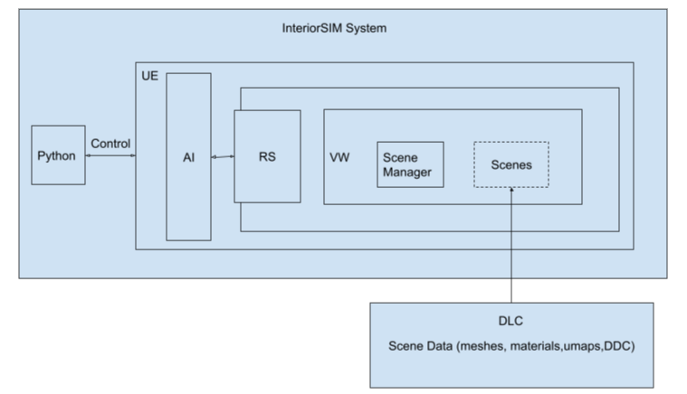
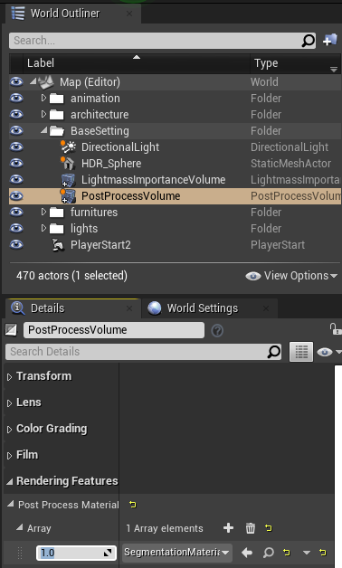
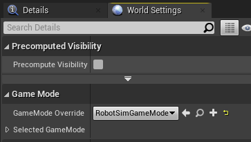
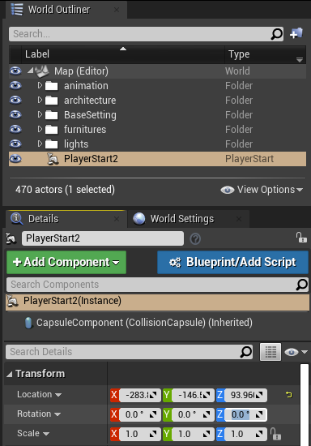
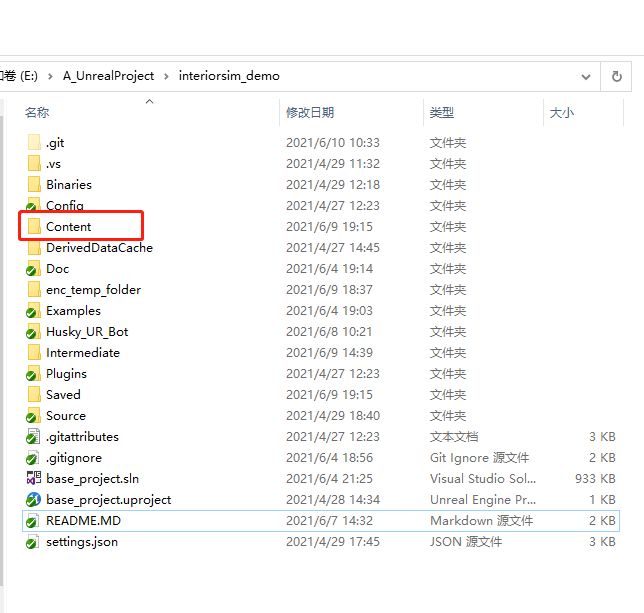
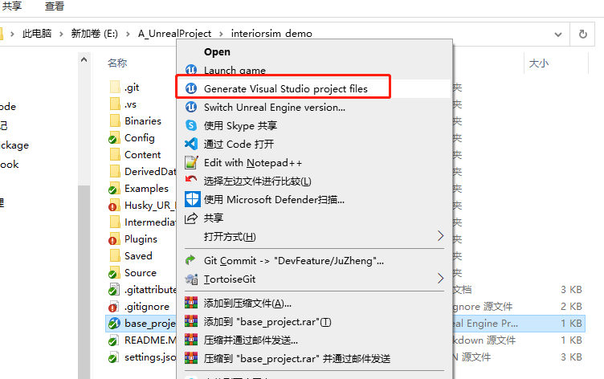
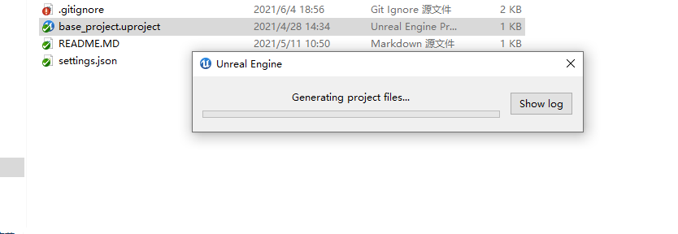
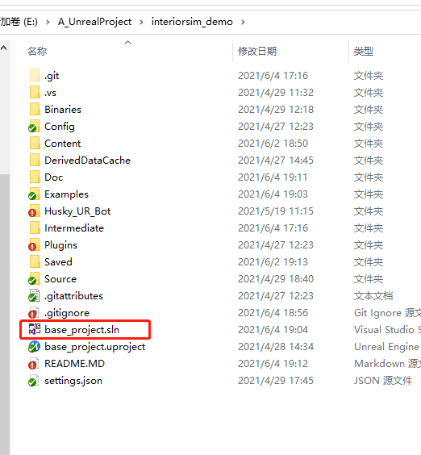
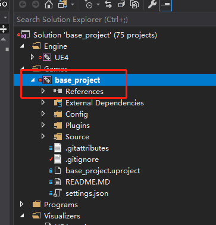
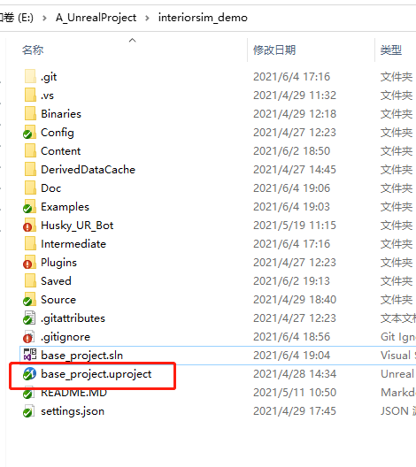

# System Overview



VirtualWorld provides UE4 scenes generated from Kujiale scene library. Use Scene Manager to download virtual worlds.

RobotSim provides robot loading and control in UE4, using Fetch as default. More robots will be supported in the future.

### Demo Video 
[Fetch grasp object in VW](https://kloudsim-usa-cos.kujiale.com/Samples_i/example_video/fetch_grasp_object.mp4)

[Fetch open door in VW](https://kloudsim-usa-cos.kujiale.com/Samples_i/example_video/fetch_open_door.mp4)

[Semantic show in VW](https://kloudsim-usa-cos.kujiale.com/Samples_i/example_video/semantic_in_vw.mp4)

### Prerequisite
Currently, VirtualWorld and RobotSim run in UE4.26.

Before building or running RobotSim, you must install Eigen and rbdl. You must also create a symbolic link from `code/unreal_plugins/RobotSim` to `code/unreal_projects/RobotProject/Plugins/RobotSim`. Finally, you must also rename `path/to/interiorsim/code/unreal_plugins/RobotSim/Source/RobotSim.Build.cs.example -> RobotSim.Build.cs` and modify the paths at the top of this file for your system.

In order to use SceneManager script, install python3 and run `pip3 install tqdm`.

RobotSim is developed on Windows. It might not be compatible with Linux or macOS, although we are working on making it so.

# Building and running on macOS or Linux

## Install and build pre-requisite libraries

#### macOS

```
# Eigen
brew install eigen

# rbdl
cd path/to/rbdl
mkdir BUILD
cd BUILD
cmake -D CMAKE_BUILD_TYPE=Release -D RBDL_BUILD_STATIC=ON -D RBDL_BUILD_ADDON_URDFREADER=ON ../
make
```

#### Linux

```
# clang
sudo apt install clang

# libc++
sudo apt install libc++-dev libc++abi-dev

# Eigen
sudo apt install libeigen3-dev

# rbdl
cd path/to/rbdl
mkdir BUILD
cd BUILD
cmake -D CMAKE_BUILD_TYPE=Release -D RBDL_BUILD_STATIC=ON -D RBDL_BUILD_ADDON_URDFREADER=ON -D CMAKE_CXX_COMPILER="clang++" -D CMAKE_CXX_FLAGS="-fPIC -stdlib=libc++" ../
make
```

## Create symbolic links to plugins

```
ln -s path/to/interiorsim/code/unreal_plugins/RobotSim path/to/interiorsim/code/unreal_projects/RobotProject/Plugins/RobotSim
```

## Configure system paths

Rename `path/to/interiorsim/code/unreal_plugins/RobotSim/Source/RobotSim.Build.cs.example -> RobotSim.Build.cs` and modify the paths at the top of this file for your system.

## Build RobotProject

#### macOS

```
path/to/UE_4.26/Engine/Build/BatchFiles/Mac/Build.sh RobotProjectEditor Mac Development path/to/interiorsim/code/unreal_projects/RobotProject/RobotProject.uproject
```

#### Linux

```
path/to/UE_4.26/Engine/Build/BatchFiles/Linux/Build.sh RobotProjectEditor Linux Development path/to/interiorsim/code/unreal_projects/RobotProject/RobotProject.uproject
```

## Run RobotProject

#### macOS

```
path/to/UE_4.26/Engine/Binaries/Mac/UE4Editor.app/Contents/MacOS/UE4Editor path/to/interiorsim/code/unreal_projects/RobotProject/RobotProject.uproject -game -WINDOWED -ResX=512 -ResY=512
```

#### Linux

```
path/to/UE_4.26/Engine/Binaries/Linux/UE4Editor path/to/interiorsim/code/unreal_projects/RobotProject/RobotProject.uproject -game -WINDOWED -ResX=512 -ResY=512 -nullrhi -RenderOffScreen
```

# Virtual World

### Scene Manager

1. Run SceneManager/scene_manager.py to download virtual worlds to `Content/`.

        scene_manager.py -i <option virtualworld-id> -v <version v1> -d <option is_download_ddc>
        # for example
        scene_manager.py -i 235554690 -v v1 -d true

   -i: optional virtualworld-id. All available id lists can be found in SceneManager/Data/virtualworld-ids.json. If not specified, all virtualworld-ids will be loaded.
   
   -v: required scene version in format of v{n}. Up-to-date version information can be found in SceneManager/dataset-repo-update.log.
   
   -d: default false, whether download ddc. See [UE4 DerivedDataCache](https://docs.unrealengine.com/4.26/en-US/ProductionPipelines/DerivedDataCache/) for more information.

2. If download fails or there are materials missing in Virtual World (mostly due to internet issues), try run 'scene_manager.py -v v1 -f true -i <virtualworld-id>' to reload the scene. Download log can be found in `Saved/UpdateLog/{virtualworld-id}_failed.txt`.

### Load Scene in UE4  

Double click `RobotProject.uproject` to open the project in UE4.

Load VirtualWorld to UE4 by selecting .umap file under `Content/maps` in Content Browser. Loading scene for the first time might take a while and local cache will be created. Loading would take shorter if cache exists.  


To view the Virtual World in semantic view, select `PostProcessVolume` in World Outliner, and set the `Post Process Material` to be 1.Set 0 to go back to normal view 



# RobotSim

### How to run RobotSim 
In UE4, In `Settings` Menu, Open `World Settings`.Under `Game Mode` in `World Settings`, make sure change `GameMode Override` to `RobotSimGameMode`.



Check the PlayerStart in World Outliner window. Make sure its Rotation is (0, 0, 0), otherwise the robot might not be loaded correctly.  



Click `Play` to start the simulation and Fetch robot will be loaded to the scene at PlayerStart.

### UrdfBot Control in UE4 Simulation
1. Press `P` in UE4 Simulation to switch the viewer camera. Camera positions settings can be found in `settings.json` at `Vehicles.UrdfBot.Cameras`. Cameras are attached to selected robot link with specified transformation.

2. Press `WASD`  or `arrow keys` to control the robot vehicle base movement.

3. Press following keys to control the robot end effector(`gripper_link`) pose. 

   `R`  - reset the robot arm to initial pose  
   `IK` - x-axis movement  
   `JL` - y-axis movement  
   `YH` - z-axis movement  
   `ZC` - x-axis rotation  
   `VB` - y-axis rotation  
   `NM` - z-axis rotation  
   `TG` - move torso_lift_link alone without moving other joints

The eef target pose is in base_link frame and calculated using InverseKinematics base on RBDL. Arm will not move if target pose is considered unreachable.

The movement smoothness depend on stiffness and damping of each joint. Press `QE` to increase or decrease stiffness and damping magnitude.

Note that due to gravity, end effector might not reach expected position. Disable the robot arm gravity by pressing `F` might provide better accuracy.

4. There are two type of manipulator control available:
   1. Press `U` to attach or detach the object in contact with `gripper_link`. This method creates a constraint between gripper_link and target object.
   2. Press `SpaceBar` to open and close gripper_finger_links. Grasp the item between two fingers based on physical interaction. 

5. Run VirtualWorld following above instruction. The Fetch robot will be loaded to the scene and can be controlled by keyboard. 

### How to use VirtualWorld or RobotSim independently?  
1. For VirtualWorld,
   * copy `Content/Koolab/` and `Content/Scene/PhyMaterials/` to the same place in your project. 
   * copy `SceneManager/` folder and run the script to download Virtual World files to `Content/`, or directly copy `content/` for VirtualWorld already downloaded. 

2. For RobotSim, there might be two options:
   1. Import RobotSim as an UE4 plugin.
   2. Develop on top of RobotSim directly.
   
Note that RobotSim requires `Examples/` and `settings.json`.

### Build RobotSim in Visual Studio
#### Prerequisite 
* 1. install unreal engine 4.26  (you can build from [source](https://github.com/EpicGames/UnrealEngine) or install form epic launcher)
* 2. install visual studio 2017  (make sure to install VC++ and Windows SDK 8.x)
* 

#### Build the project
* Right click mouse select "generate visual studio project file".  
  
* Wait for generating complete.  
  
* Open XXX.sln to open the project in Visual Studio.  
  
* Build this project and run in Visual Studio.  
  
* open XXX.uproject after visual studio project build complete.  
  
